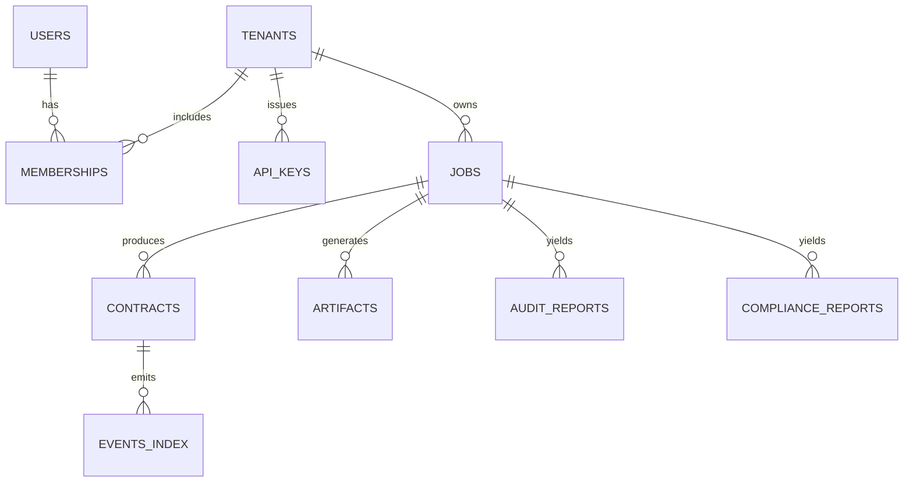

# Database & User Management Plan for the SDK/Orchestrator

This plan adds a durable database and user/tenant management to persist core data beyond `tmp/`, so jobs, contracts, verification, and audit/compliance reports remain safe and queryable. It is designed to layer cleanly on top of the current API routes in `api/routes/` and the SDK server plan.

## Objectives
- **Durable persistence** for Jobs, Contracts, Verification status, Audit/Compliance reports, and Artifacts metadata.
- **User/Tenant management** with API keys, RBAC, and per-tenant isolation.
- **Backfill** from existing `tmp/jobs/<jobId>` directories.
- **Railway-native**: Use managed Postgres and env-based secrets.

## Recommended Stack
- **Database**: Postgres (Railway managed). Use `DATABASE_URL`.
- **ORM**: Prisma (TypeScript) or Knex. Prisma is recommended for schema DX and type-safety.
- **Auth**: API Key (header `x-api-key`) for server-to-server + optional JWT for user sessions.
- **RBAC**: Role-based method allowlists per tenant.

## Core Entities (Schema)
Store only what is needed; keep large blobs optional (e.g., store report JSON in JSONB, or store file paths and fetch on demand).

- **users**
  - id (uuid), email (unique), name, wallet_address (optional), status, created_at
  - Auth via password/SSO is optional; API-key only is acceptable for server-to-server.

- **tenants**
  - id (uuid), name, created_at
  - One or more users can belong to a tenant.

- **memberships**
  - user_id, tenant_id, role ('owner'|'admin'|'writer'|'reader'), created_at

- **api_keys**
  - id (uuid), tenant_id, key_hash (never store raw), name/label, scopes (json), write_allowlist (string[]), last_used_at, created_at, revoked_at

- **jobs**
  - id (text, matches current jobId), type, state, step, progress, error (jsonb), timings (jsonb), payload (jsonb),
  - result_summary (jsonb: address, fqName, params.args, network), created_at, updated_at, tenant_id (nullable if single-tenant)

- **contracts**
  - id (uuid), job_id (text), network (text), address (text index), fq_name (text), deployer (text), params_args (jsonb),
  - verified (bool), explorer_url (text), created_at, tenant_id

- **artifacts** (lightweight index)
  - id (uuid), job_id, kind ('abi'|'source'|'script'|'other'), name (text), path (text),
  - abi (jsonb, optional), bytecode_len (int, optional), created_at, tenant_id

- **audit_reports**
  - id (uuid), job_id, contract_id (nullable), profile (text), score (numeric), severity_max (text),
  - raw (jsonb), created_at, tenant_id

- **compliance_reports**
  - id (uuid), job_id, contract_id (nullable), profile (text), strict (bool), score (numeric), passed (bool),
  - raw (jsonb), created_at, tenant_id

- (Optional) **events_index**
  - id (uuid), contract_id, event (text), block_number, tx_hash, log_index, args (jsonb), created_at

## Data Lifecycle and Sources of Truth
- **Jobs**: The running in-memory job remains the real-time source. On changes, upsert slim rows in `jobs` for durability.
- **Contracts**: When pipeline/fix deploys, upsert `contracts` with `{ address, network, fqName, params_args }`.
- **Verify**: On success, set `contracts.verified=true` and store `explorer_url`.
- **Reports**: When `/api/audit/*` or `/api/compliance/*` produce JSON, save the canonical report in JSONB and optionally link to file path.
- **Artifacts**: When `/api/artifacts/*` lists ABIs/sources, index the ABI filenames and optionally cache ABI JSON.

## Integration Points (Where to Persist)
- `api/routes/ai.js`
  - On job accept: insert `jobs` with `{ id, type='ai_pipeline', state='running', payload.network, ... }`.
  - On progress updates: optional (or final-only to reduce writes).
  - On deploy success: upsert `contracts` from `result` and update `jobs.result_summary`.
  - On failure: update `jobs.state='failed'` and store error summary.

- `api/routes/verify.js`
  - On `/byJob` success: set `contracts.verified=true, explorer_url` for that job’s address.
  - On `/byAddress` success: upsert a `contracts` row by address+network if not present and mark verified.

- `api/routes/artifacts.js`
  - On `GET /api/artifacts/abis?jobId=...`: after computing response, upsert `artifacts` rows for ABIs (name, path, abi?bytecode?).
  - Optional: cache only `abi` arrays (omit bytecode to keep rows small).

- `api/routes/audit.js` and `api/routes/compliance.js` (if present)
  - After generating a report: insert into `audit_reports` / `compliance_reports` with raw JSONB and key summary fields.

- `api/routes/jobs.js`
  - On `GET /api/job/:id/status?verbose=1`: optional background sync to DB if job is found in memory but missing in DB.

## User & Tenant Model
- **Single-tenant**: simplest; all data belongs to one tenant.
- **Multi-tenant**: recommended for SaaS. Every persisted row references `tenant_id`.
- **API keys**: header `x-api-key` → look up `api_keys.key_hash` → resolve `tenant_id` → authorize route + populate `req.tenantId`.
- **RBAC**: `memberships.role` + `api_keys.scopes` govern access:
  - Reads allowed for `reader` and above.
  - Writes (deploy/verify/send) allowed for `writer` and above + allowlisted methods.

## Authentication and Authorization Flows
- **API Key**
  - Provisioned per-tenant in DB with write allowlist and scopes. Present only on write routes.
  - Store only a hash (e.g., SHA-256 with salt). Compare hashes on request.

- **JWT (optional)**
  - For dashboards and operator UIs. JWT contains `sub=userId`, `tenantId`, `role` claims.
  - Gateway issues JWT on sign-in; SDK server trusts via shared secret/JWKS.

- **SIWE (optional)**
  - Map an EOA to a user for role-based restrictions.

## Migrations & Setup (Railway)
- Add Postgres in Railway → copy `DATABASE_URL`.
- ORM (Prisma) steps:
  - Add Prisma schema with tables above; mark JSONB fields.
  - Run `prisma migrate dev` locally; then `prisma migrate deploy` in Railway.
  - Set `DATABASE_URL` in Railway variables for your service.
- Ensure your server uses pooled connections (e.g., `pg` with pgBouncer-compatible config) and retries on boot.

## Backfill Strategy (tmp ➜ DB)
Create a one-off script or admin endpoint to ingest from `tmp/jobs/`:
- Walk `tmp/jobs/<jobId>/deploy/result.json` → upsert `jobs` + `contracts`.
- Read `tmp/jobs/<jobId>/audit/report.json` → insert `audit_reports`.
- Read `tmp/jobs/<jobId>/compliance/report.json` → insert `compliance_reports`.
- Read `tmp/jobs/<jobId>/artifacts/contracts/**/*.json` → index into `artifacts` (ABI name/path, optional abi array).
- Mark each jobId as `backfilled_at` to avoid duplicate work.

Batch backfills should run with limited concurrency to avoid DB spikes.

## Query Patterns (Examples)
- Get latest contract by job:
  - `SELECT * FROM contracts WHERE job_id = $1 ORDER BY created_at DESC LIMIT 1;`
- List a tenant’s verified contracts:
  - `SELECT address, network, fq_name, created_at FROM contracts WHERE tenant_id=$1 AND verified IS TRUE ORDER BY created_at DESC;`
- Fetch latest audit/compliance for a contract:
  - Join `contracts` on job_id → pick most recent reports by created_at.

## Security & Compliance
- Secrets: DB URL and API keys only via Railway variables.
- Data minimization: store only summaries and pointers; raw artifacts remain on disk unless needed in JSONB.
- Row-level access: always filter by `tenant_id` where multi-tenant.
- Auditing: log admin actions, API key creation, and write operations.

## Monitoring & Operations
- Add `/db/health` that runs a trivial query with timeout.
- Metrics: track number of jobs/contracts/reports per day; verify success rate; DB error rates.
- Backups: Railway Postgres comes with snapshotting; verify retention meets your needs.

## Rollout Plan
1) Add Prisma + schema, create migrations, provision Railway Postgres, set `DATABASE_URL`.
2) Implement write-through hooks in `ai.js` (on final deploy), `verify.js` (on success), `artifacts.js` (on listing) to upsert rows.
3) Add API-key middleware; require key for write routes; attach `tenant_id` to persisted rows.
4) Run backfill over existing `tmp/jobs/*` once; validate counts.
5) Update docs and Postman collection; train team on access patterns.

## Testing Plan
- Unit-test persistence helpers with an in-memory or test Postgres.
- Integration tests for end-to-end flows: pipeline → verify → compliance/audit → query DB.
- Backfill dry-run: report inserted counts; idempotency checks.

## How This Fits Your Current Codebase
- Works with:
  - Job output fields in `api/routes/ai.js` (result: `{ address, fqName, params.args, network }`).
  - Verify outcomes in `api/routes/verify.js` (verified, explorerUrl).
  - Artifacts enumerations in `api/routes/artifacts.js`.
  - Jobs endpoints in `api/routes/jobs.js` for status/log streaming.
- Extends the SDK server plan (`updated/backend_sdk_api_service_plan.md`) by providing durable storage and user/key-based access control.

## Next Steps
- Approve Postgres + Prisma stack and schema above.
- I will then:
  - Add Prisma schema + migrations.
  - Implement minimal persistence helpers and API key middleware.
  - Provide a backfill script with a dry-run mode.
  - Update the SDK server to read contract bindings by `tenant_id + jobId` from DB first, with artifacts as fallback.
