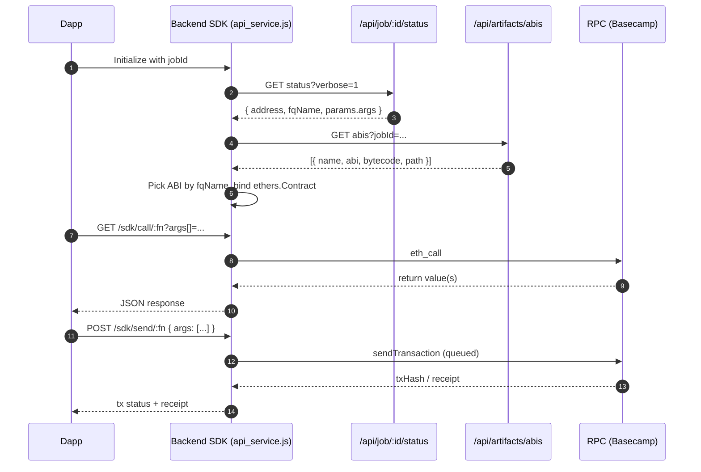

# Backend SDK API Service Plan (api_service.js)

A job-aware, contract-ABI-based HTTP server that exposes a clean SDK-like API for any contract produced by the AI pipeline. It derives the contract address and ABI via jobId from existing services and deploys to Railway so downstream dapps can integrate immediately.

## Objectives
- Provide a minimal, production-ready “backend SDK server” that:
  - Fetches the deployed contract address, fully-qualified name (FQN), and constructor params from a jobId.
  - Fetches the ABI and bytecode artifacts associated with the job.
  - Exposes standard, typed REST endpoints to read/write contract methods and stream events.
  - Can be safely hosted on Railway with environment-guarded write access.
- Zero manual wiring per contract: the service introspects the ABI and auto-generates the surface.

## Source of Truth and Inputs
- Existing endpoints provided by your API gateway (see `api/server.js` mounts):
  - `GET /api/job/:id/status?verbose=1` – retrieve job `result` including `address`, `fqName`, `params.args`.
  - `GET /api/artifacts/abis?jobId=...` – list ABI JSONs for the job sandbox or project fallback (see `api/routes/artifacts.js`).
  - Optional: `GET /api/artifacts?jobId=...&include=all` – for cross-checking source/script listings.
- Network and signer:
  - RPC URL per target network (e.g., Basecamp).
  - Private key only required for write endpoints; read-only flows work without it.

## High-Level Flow
1. Resolve job metadata: address, fqName, constructor args.
2. Fetch ABI JSONs for the job; pick the ABI matching the fqName’s contract.
3. Spin up an Express server that binds ethers.js `Contract` with the network provider and optional signer.
4. Expose generic endpoints for discovery, reads, writes, and events.
5. Protect writes using API keys and allowlists. Queue transactions to avoid nonce collisions.
6. Ship on Railway with environment-driven config.

## Components and Responsibilities
- **ArtifactResolver**
  - Inputs: `BASE_URL`, `JOB_ID`.
  - Calls `GET /api/job/:id/status?verbose=1` to get `result.address`, `result.fqName`, `result.params.args`.
  - Calls `GET /api/artifacts/abis?jobId=...` to obtain ABI JSONs; selects the one matching fqName contract name.
  - Fallback: if fqName missing, pick the artifact with deployable bytecode that best matches common heuristics (like the AI pipeline’s deploy selection).

- **ContractBinder**
  - Creates ethers `JsonRpcProvider` using `RPC_URL` or a known alias.
  - Initializes read-only `Contract` with ABI + address.
  - If `PRIVATE_KEY` present, binds a signer for write operations.

- **MethodRouter (auto-generated endpoints)**
  - Discovers ABI entries and exposes standardized routes:
    - Discovery: `/sdk/health`, `/sdk/contract`, `/sdk/abi`, `/sdk/methods`
    - Reads: `GET /sdk/call/:method?args[]=...`
    - Writes: `POST /sdk/send/:method` with `{ args: [...] }`
    - Events: `GET /sdk/events/stream` (SSE), `GET /sdk/events/poll?fromBlock=...`
  - Validates arguments per ABI types; returns normalized values (strings for bigints, hex for bytes).

- **TxQueue**
  - Per-network queue to serialize write transactions and avoid nonce collisions.
  - Emits progress logs and persist results to memory.

- **Auth & Safety**
  - API key header check for write routes (e.g., `x-api-key`).
  - Optional method allowlist (`SDK_WRITE_ALLOWLIST=transfer,approve,...`).
  - `express-rate-limit` for write routes; `helmet` + CORS allow-list.

- **Observability**
  - Structured logging via `pino` or `morgan`.
  - Simple `/sdk/health` returns contract address, network, readiness state.

## Proposed Endpoint Surface
- **Discovery**
  - `GET /sdk/health` → `{ ok, network, address, contract, jobId }`
  - `GET /sdk/contract` → `{ address, fqName, hasSigner }`
  - `GET /sdk/abi` → raw ABI JSON
  - `GET /sdk/methods` → `{ reads: [...], writes: [...], events: [...] }`

- **Reads**
  - `GET /sdk/call/:method?args[]=...`
  - Response shape: `{ ok, method, args, result }`

- **Writes**
  - `POST /sdk/send/:method`
  - Body: `{ args: [...], gasLimit?: string, valueWei?: string }`
  - Headers: `x-api-key: <key>`
  - Response: `{ ok, txHash, status, receipt? }` (polling helper optional: `/sdk/tx/:hash`)

- **Events**
  - `GET /sdk/events/stream?event=Name&fromBlock=...` (SSE: emits JSON per log)
  - `GET /sdk/events/poll?event=Name&fromBlock=...&toBlock=...` → `{ logs: [...] }`

- **Admin**
  - `POST /sdk/reload` – re-fetch ABI/address from `JOB_ID` (guarded via API key)

## Bootstrapping From jobId (Mapping Rules)
- **Get job output**
  - `GET $BASE_URL/api/job/$JOB_ID/status?verbose=1`
  - Expected fields:
    - `result.address` – deployed address
    - `result.fqName` – `contracts/<file>.sol:<Contract>`
    - `result.params.args` – constructor args (for reference/documentation)

- **Get ABI(s)**
  - `GET $BASE_URL/api/artifacts/abis?jobId=$JOB_ID`
  - Select ABI whose basename matches the `Contract` in `fqName`.
  - Fallbacks: if multiple candidates, prefer one with non-empty `bytecode`.

- **Network alignment**
  - Prefer the job’s `result.network`. If unspecified, use `NETWORK` env default.

## Configuration (Environment Variables)
- **Core**
  - `PORT` – default 8080 (Railway provides)
  - `BASE_URL` – upstream aggregator API (e.g., `https://evi-v4-production.up.railway.app`)
  - `JOB_ID` – default job to load on boot (can also be passed per-request via header/query if you want multi-job support)
  - `NETWORK` – network key (e.g., `basecamp`)
  - `RPC_URL` – full RPC endpoint (if not using a baked-in alias)

- **Write Access**
  - `PRIVATE_KEY` – hex private key for signer (only if enabling writes)
  - `SDK_API_KEY` – required header for all write routes
  - `SDK_WRITE_ALLOWLIST` – comma-separated method names allowed for writes

- **Security & Ops**
  - `CORS_ORIGIN` – comma-separated allowed origins
  - `RATE_LIMIT_WINDOW_MS`, `RATE_LIMIT_MAX`
  - `LOG_LEVEL` – info|debug|warn|error

## Deployment on Railway (No Code, Process Only)
- **Create a new Railway service**
  - Link the repository containing `api/api_service.js` and a minimal `package.json` with a start script (implementation to be added later).
  - Set Node.js 18+.

- **Configure variables**
  - `BASE_URL` = your aggregator (e.g., `https://evi-v4-production.up.railway.app`)
  - `JOB_ID` = the AI pipeline job id producing the target contract
  - `NETWORK` = `basecamp`
  - `RPC_URL` = Basecamp RPC (e.g., `https://rpc.basecamp.t.raas.gelato.cloud`)
  - `PRIVATE_KEY` = only if you want writes from the server
  - `SDK_API_KEY` = strong value
  - Optional: `CORS_ORIGIN`, `RATE_LIMIT_*`, `LOG_LEVEL`

- **Start command**
  - `node api/api_service.js`

- **Health check**
  - Path `/sdk/health` must return 200 JSON within 10s

## Testing Playbook (Against Railway)
- **Check job and artifacts**
  - `curl -s "$BASE_URL/api/job/$JOB_ID/status?verbose=1" | jq '.result | {address, fqName, network}'`
  - `curl -s "$BASE_URL/api/artifacts/abis?jobId=$JOB_ID" | jq '.abis | map({name, path})'`

- **SDK server discovery**
  - `curl -s "$SDK_URL/sdk/health" | jq '.'`
  - `curl -s "$SDK_URL/sdk/contract" | jq '.'`
  - `curl -s "$SDK_URL/sdk/methods" | jq '.'`

- **Read call**
  - Example: `curl -s "$SDK_URL/sdk/call/owner" | jq '.'`
  - With args: `curl -s "$SDK_URL/sdk/call/balanceOf?args[]=0xYourAddr" | jq '.'`

- **Write call** (guarded)
  - `curl -s -X POST "$SDK_URL/sdk/send/transfer" -H "x-api-key: $SDK_API_KEY" -H "Content-Type: application/json" -d '{"args":["0xTo","1000000000000000000"]}' | jq '.'`

- **Events**
  - SSE: `curl -N "$SDK_URL/sdk/events/stream?event=Transfer&fromBlock=latest"`

## Security & Hardening
- **Auth**: API-key on writes; optional IP allowlist.
- **Validation**: Validate args count/types per ABI; reject unknown methods.
- **Rate limiting**: Strict for writes; moderate for reads.
- **CORS**: Restrict to your frontend origins.
- **Secrets**: Use Railway variables; never log secrets.

## Multi-Contract & Multi-Job Support (Optional)
- Add optional `x-job-id` header or `?jobId=` query to override the boot `JOB_ID`.
- Cache ABIs per jobId; reload via `/sdk/reload`.
- If a job deployed multiple contracts, allow selecting by `?contract=Name`.

## Observability and Error Handling
- Consistent JSON problem responses: `{ ok: false, code, message, details }`.
- Log each external call to Jobs/Artifacts with latency and status.
- Emit transaction lifecycle events: queued → sent → mined.

## Alignment with Existing Docs
- Frontend docs under `updated/frontend_audit_compliance_verify.md` and `updated/frontend_audit_compliance_apis.md` already describe Audit/Compliance/Verify and Artifacts flows. This SDK service reuses:
  - `/api/job/:id/status` to discover deployment outputs.
  - `/api/artifacts/*` to retrieve ABIs and sources.
  - `/api/verify/*` (optional) if you want the SDK to expose a verification helper.

## Milestones
- **M1 – Design & scaffolding (0.5 day)**
  - Finalize endpoint contract and environment variables.
- **M2 – Artifact resolution (0.5 day)**
  - Wire `jobId → { address, fqName }` and ABI selection logic.
- **M3 – Read-only surface (0.5 day)**
  - Implement `/sdk/*` discovery + `GET /sdk/call/:method`.
- **M4 – Write surface with safety (1 day)**
  - API-key, allowlist, queue, basic telemetry.
- **M5 – Events (0.5 day)**
  - SSE streaming + polling.
- **M6 – Packaging & Railway deployment (0.5 day)**
  - Procfile/start script, envs, health check, smoke tests.

## Next Steps (What you’ll get after implementation)
- A single file `api/api_service.js` (plus minimal wiring) that turns any AI jobId into a usable contract backend.
- A deployed Railway service URL like `https://<your-subdomain>.up.railway.app` ready for your dapp to call.
- A concise README snippet for your dapp team on how to call reads/writes securely.
